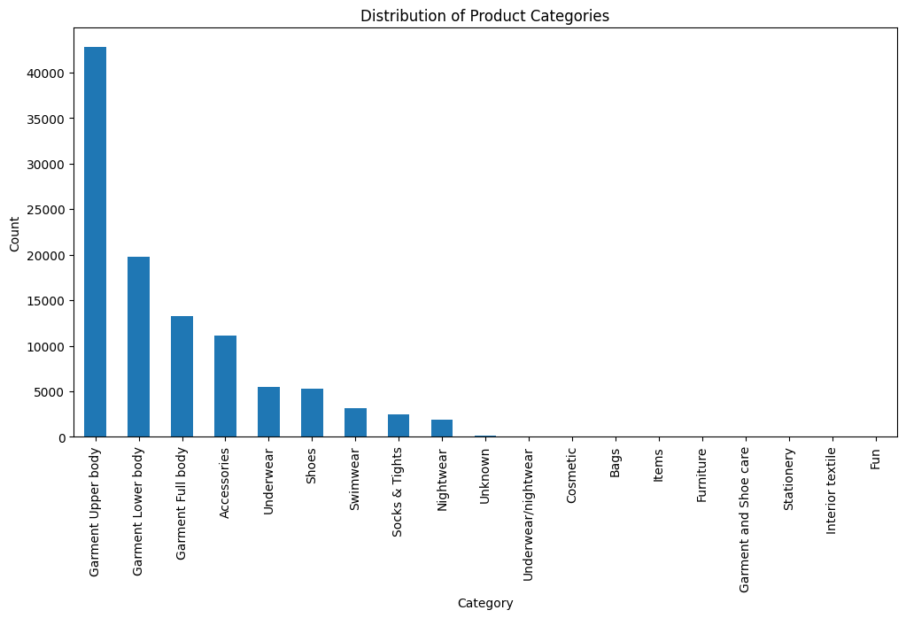
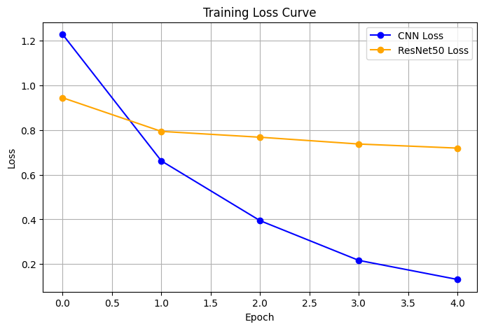
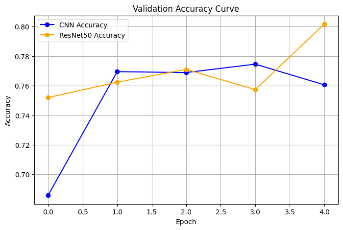
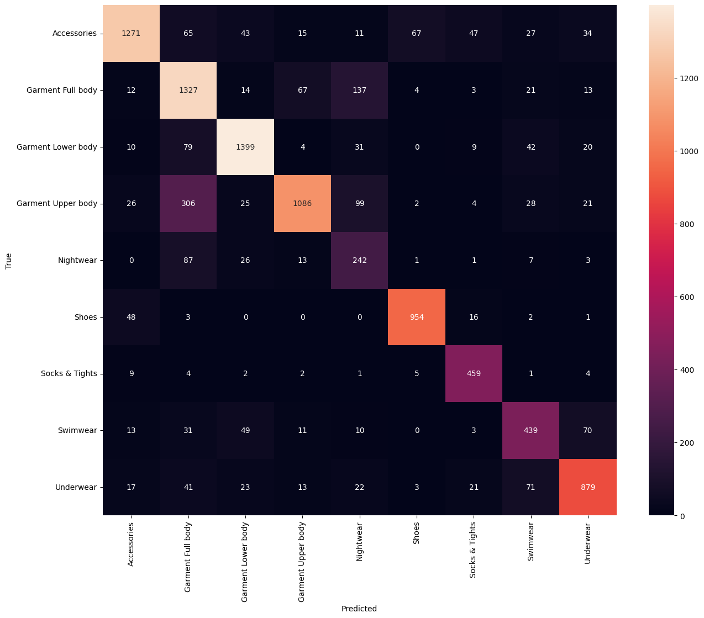
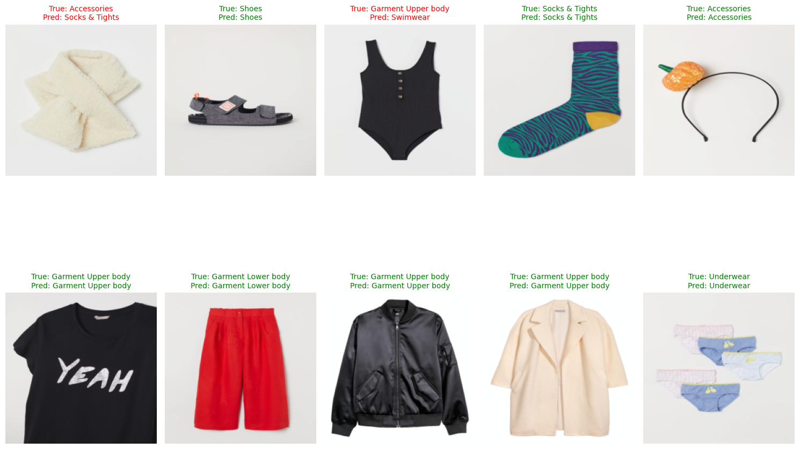

# Fashion Product Service

A machine learning-based analysis service for fashion products. This project began as a Pattern Recognition course assignment (image classification) and is being expanded into a full backend application prototype that includes price prediction and an API service.

---

## Project Overview

This project is divided into two main phases:

* **Part 1: Fashion Image Classifier (Course Project)**
    * **Objective:** To train a high-accuracy Convolutional Neural Network (CNN) model for classifying fashion product images from the H&M dataset. This part serves as the final project for a Pattern Recognition course.
    * **Core Technologies:** PyTorch, CNN, Transfer Learning, Data Augmentation.

* **Part 2: Product Price Prediction API (Personal Extension)**
    * **Objective:** To build a price prediction model using text and price data, integrate it with the image classifier from Part 1, and encapsulate the entire service as a complete Web API using FastAPI and Docker.
    * **Core Technologies:** Scikit-learn, FastAPI, Docker, REST API.

---

## Tech Stack

* **Data Analysis & Model Training:** Python, Pandas, PyTorch, Scikit-learn, Jupyter Notebook
* **Backend Service:** FastAPI, Uvicorn
* **Deployment:** Docker
* **Development Environment:** Visual Studio Code, Google Colab

---

## Part 1: Fashion Image Classifier (Course Project Details)

### Objective
For the course "Pattern Recognition," this project aims to design, train, and evaluate a high-accuracy deep learning image classifier on a large-scale, real-world e-commerce dataset from H&M. The core challenge lies in handling a real-world dataset with severe class imbalance and validating the effectiveness of advanced techniques like transfer learning and data augmentation through a comparative analysis against a baseline model.

### Methodology & Process

#### 1. Data Exploration & Preprocessing
The first step was to perform an exploratory data analysis (EDA) on the original dataset. The analysis revealed a severe **Class Imbalance** problem.

As shown in the figure above, the `Garment Upper body` class contains over 42,000 samples, while several classes in the long tail have fewer than 10 samples. This long-tail distribution poses a significant challenge for model training:

1.  The model would be heavily biased towards the majority classes, neglecting to learn features for the minority classes.
2.  Classes with too few samples lack statistical significance and could act as noise rather than a useful learning signal.

To address this issue and create a more balanced dataset suitable for model training, the following key preprocessing steps were taken:

* **Filtering Rare Classes:** All product categories with fewer than 1,000 samples were removed, focusing the task on the 9 most frequent classes.
* **Undersampling Majority Classes:** To further mitigate the imbalance and reduce training overhead, a sample limit of **8,000** was applied to the selected 9 classes. For any class exceeding this limit, a random subset of 8,000 samples was selected; otherwise, all samples were retained.

#### 2. Model Selection & Training
Two technical approaches were designed for a comparative experiment:
* **Baseline Model**: A `SimpleCNN` was built from scratch without any pre-trained weights to establish an initial performance benchmark.
* **Improved Model**: A **Transfer Learning** strategy was adopted using a **`ResNet50`** model pre-trained on ImageNet. Its final classification layer was replaced to fit our 9 project-specific categories, and only this new layer and a few of the upper layers were fine-tuned.

During the training phase, both models utilized a **Weighted Cross-Entropy Loss** function, which assigns a higher weight to minority classes during loss calculation to further combat the class imbalance at an algorithmic level.

### Results & Analysis

#### Performance Comparison
After training on Google Colab's cloud GPUs, the best performance for both models is summarized in the table below:

| Model | Key Techniques | Best Validation Accuracy |
| :--- | :--- | :--- |
| Baseline Model | SimpleCNN | **77.46%** (at Epoch 3) |
| **Improved Model** | **ResNet50 + Data Augmentation** | **80.17%** (at Epoch 4) |

The data clearly shows that the improved ResNet50 model outperforms the baseline in terms of accuracy. More importantly, an analysis of the training process reveals that the baseline model began to **overfit** after the 3rd epoch (as validation accuracy decreased), whereas the improved model, benefiting from the powerful regularization effects of data augmentation and pre-trained weights, demonstrated a more stable performance and stronger generalization ability.

#### Training Process Visualization

To more intuitively compare the training dynamics of the two models, the training loss and validation accuracy curves over 5 epochs were plotted.

**Analysis:** It is evident from the charts that:
* **Training Loss:** The baseline CNN's loss (blue line) drops rapidly towards zero, a typical characteristic of overfitting. In contrast, the ResNet50 model's loss (orange line) decreases more gently, indicating that regularization methods like data augmentation effectively prevented the model from merely memorizing the training data.
* **Validation Accuracy:** The baseline model's accuracy peaked at Epoch 3 and then began to decline, further confirming the occurrence of overfitting. The ResNet50 model, despite some fluctuations, ultimately achieved a higher performance point (80.17%), proving its superior generalization ability.

Even within just 5 epochs of training, the behavioral differences between the two models are stark, fully validating the effectiveness of the improvement strategies.

#### Confusion Matrix Analysis
The following confusion matrix is for the improved ResNet50 model on the validation set:

* **Strengths**: The strong diagonal indicates that the model achieved high prediction accuracy across most categories, especially on visually distinct classes like `Accessories`, `Shoes`, and `Garment Lower body`.
* **Areas for Improvement**: The matrix also clearly reveals the model's main "points of confusion." The most significant confusion occurs when **`Garment Upper body` is misclassified as `Garment Full body`**. This is visually logical, as the upper part of a dress is very similar to a T-shirt.

#### Prediction Examples
To intuitively understand the model's behavior, we randomly sampled and visualized some predictions on the validation set:

The figure above (green for correct, red for incorrect) shows that the model can accurately identify most standard items. Some interesting error cases, such as predicting a one-piece swimsuit (True label: `Garment Upper body`) as `Swimwear`, suggest that in some sense, the model's prediction may be more aligned with human cognition than the original label, exposing potential ambiguities within the dataset itself.

### Conclusion
This project successfully built and optimized a fashion product image classifier. The experiments demonstrate that a strategy combining ResNet50-based transfer learning with data augmentation can effectively handle real-world datasets with class imbalance, achieving a final validation accuracy of **80.17%** and significantly outperforming the baseline model.

---

## Part 2: Future Work - Product Price Prediction API

After successfully building a high-accuracy image classifier, the second phase of this project aims to extend it into a more functionally complete full-stack application prototype.

The goal is to combine Natural Language Processing (NLP) and Machine Learning techniques to create an intelligent service that can provide both **category predictions** and **price suggestions** based on a product's image and text description. This not only enhances the project's completeness but also serves as an exploration into building end-to-end machine learning systems.

**The core planned features and technical implementation include:**

* **Model Integration:**
    The PyTorch image classifier from Part 1 will be integrated with a new price prediction model trained on product text descriptions (e.g., brand, condition, material) using Scikit-learn.

* **API Service Encapsulation:**
    The integrated models will be encapsulated into an efficient, asynchronous REST API using the **FastAPI** framework. The API will be able to receive image and text inputs and return prediction results in JSON format.

* **Containerized Deployment:**
    The entire application will be containerized using **Docker** to achieve environment isolation and enable one-click deployment, preparing for future deployment on cloud platforms.